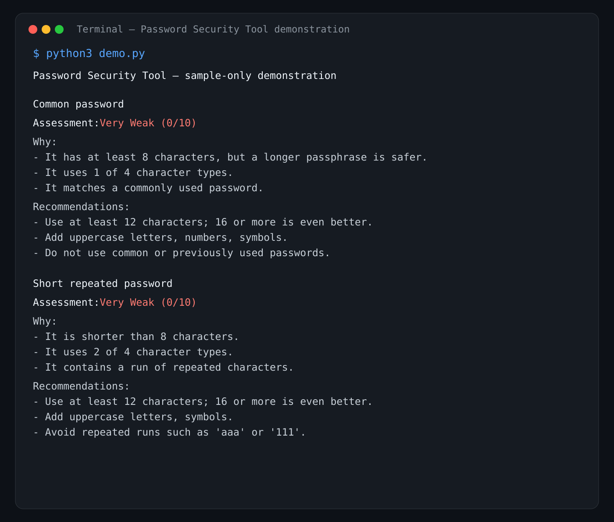
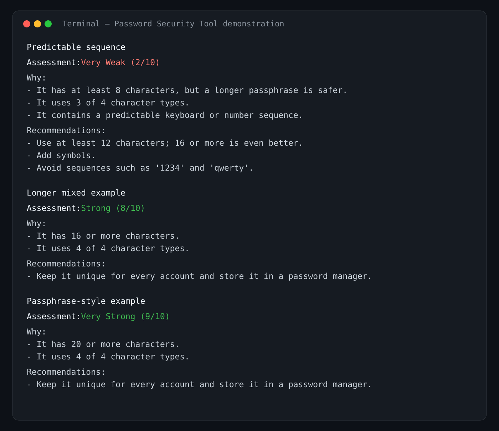

# Password Security Tool

## 1. Project Title

**Password Security Tool** is a small local Python program that explains password-security risks using sample passwords only.

## 2. Project Objective

Help users understand why a password is weak or strong and how to make safer choices. This is an educational heuristic, not a guarantee of security.

## 3. Features

- Accepts one password for local analysis with masked terminal input (`*` per character).
- Assesses length, character diversity, common passwords, repeated characters, and predictable sequences.
- Returns a five-level rating: Very Weak, Weak, Moderate, Strong, or Very Strong.
- Explains the rating and gives specific recommendations.
- Includes five safe sample cases and automated tests.

## 4. Technologies Used

- Python 3
- Python standard library only (`getpass`, `re`, `dataclasses`, and `unittest`)

## 5. Project Structure

```text
password-security-tool/
├── app.py                    # Private interactive analysis
├── password_analyzer.py      # Scoring rules
├── demo.py                   # Fictional demonstration cases
├── test_password_analyzer.py # Automated tests
├── README.md
└── .gitignore
```

## 6. Setup Instructions

1. Install Python 3.10 or newer.
2. Download or clone this repository.
3. Open a terminal in the `password-security-tool` folder.

No packages need to be installed.

## 7. How to Run

Run interactive analysis (use a fictional test password only):

```bash
python3 app.py
```

Run the prepared demonstration:

```bash
python3 demo.py
```

On Windows, run the same commands with `py` instead:

```bat
py demo.py
py app.py
```

## 8. How the Analysis Works

The score starts at zero. Longer passwords (with an extra point for 20+ characters) and each of four character types (uppercase, lowercase, number, symbol) add points. Common passwords, repeated-character runs, and keyboard/number sequences subtract points. The score is limited to 0–10 and mapped to a clear rating.

## 9. Test Cases and Results

| Sample case | Expected outcome | Why |
| --- | --- | --- |
| `password` | Very Weak | Common, short, and low diversity |
| `aaa111` | Very Weak | Short and repeated characters |
| `Qwerty1234` | Very Weak | Predictable keyboard and number sequences |
| `Maple!River7Cloud` | Strong | Long and uses all character types |
| `Cedar-Moon-47!Harbor` | Very Strong | Long passphrase-style sample with diversity |

Run the tests:

```bash
python3 -m unittest -v
```

## 10. Privacy and Security

The tool processes one entered password only in program memory. It does not write the password to a file, database, log, or network service, and it never prints the entered value. It displays a `*` for each character while you type; this reveals length but not the characters. For this assignment, use sample passwords only—never real passwords.

## 11. Demo and Screenshots

The project includes two submission-safe screenshots of the demonstration. They show only fictional test cases and never a real password.





## 12. Limitations and Future Improvements

This compact tool uses understandable heuristic rules and a small common-password list. A production tool could check a maintained breached-password dataset using a privacy-preserving method, estimate resistance to guessing, add more pattern detection, and include a graphical interface. It should still avoid collecting passwords.

## 13. GitHub Submission Checklist

1. Create a new GitHub repository named `password-security-tool`.
2. Add these project files and this README.
3. Run `python3 -m unittest -v` and `python3 demo.py` before uploading.
4. Add your demo screenshot if your instructor requires one.
5. Commit and push:

```bash
git init
git add .
git commit -m "Build password security tool"
git branch -M main
git remote add origin https://github.com/YOUR-USERNAME/password-security-tool.git
git push -u origin main
```

Replace `YOUR-USERNAME` with your GitHub username. Do not commit real passwords, `.env` files, or secrets.
